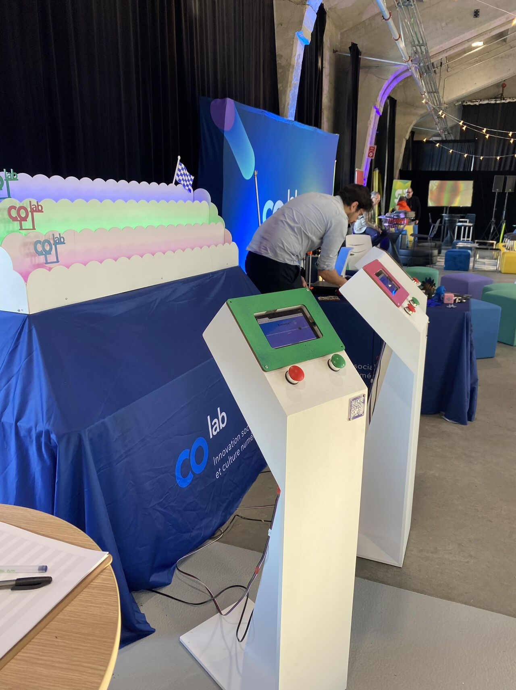
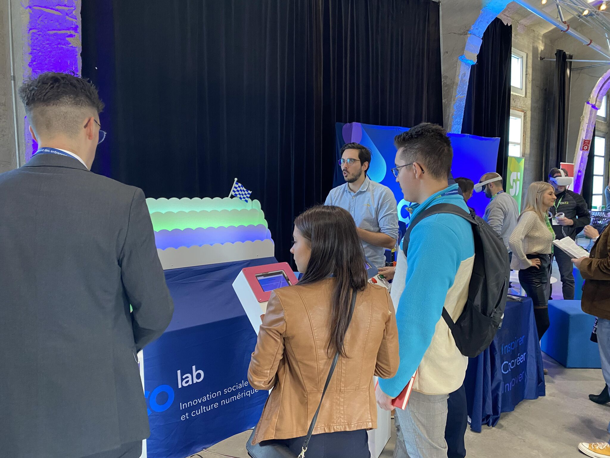
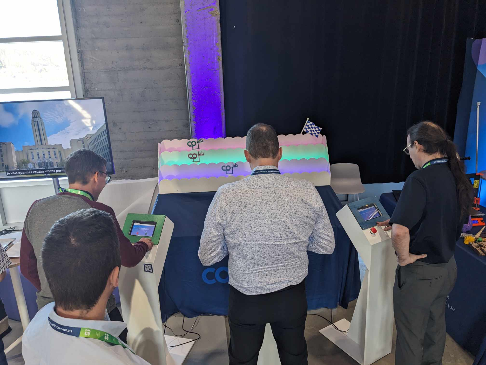
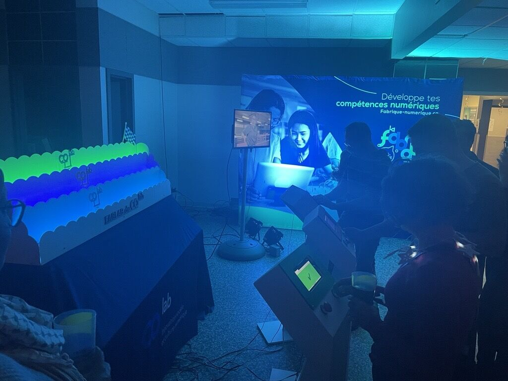

# COlab game

## Overview
The COlab game is like a Horse Racing Game at a carnival where players must answer questions correctly to advance their cursor on the racecourse, with incorrect answers incurring a 2-second penalty. Each stand features an ESP32 microcontroller, a tablet connected via WiFi, and green/red push buttons for interaction.
> Made in 2 months. (19 Sept - 16 Nov)

## Table of Contents
- [Features](#features)
- [Technologies Used](#technologies-used)
- [Demo](#demo)
- [License](#license)

## Features

- **Stand Progression**: Enjoy a unique gaming experience with three distinct stands, each offering its own set of challenges and questions. Progress through the game by successfully answering questions at each stand, providing a dynamic and engaging gameplay.

- **Chronometer**: Keep track of the time spent during the game with a built-in chronometer, ensuring players are aware of their performance.

- **Touch-based Reset System**: Utilize the ESP32's touch pins to implement a user-friendly game reset feature. Players can reset the game by interacting with the touch-sensitive elements.

## Technologies Used

### Basic

- **HTML**: The backbone of the project, providing the structure for web pages and content.

- **CSS**: Responsible for styling and ensuring a visually appealing and responsive design for an optimal user experience.

- **JavaScript (JS)**: Enhances interactivity and dynamic behavior on the client side, improving user engagement.

- **JSON**: Facilitates data interchange and plays a crucial role in structuring information between the server and the client.

- **C++**: The programming language that will be used for server-side logic and backend development.

- **Arduino IDE**: The integrated development environment for programming and uploading code to Arduino boards.

- **ESP32**: A powerful microcontroller that will be used as the main hardware for the project.

### Arduino libraries

- **WiFi.h**: Manages the connection to a Wi-Fi network, allowing the ESP32 to communicate over the internet.

- **AsyncTCP.h**: Enables asynchronous communication over TCP, improving the efficiency of data exchange.

- **ESPAsyncWebServer.h**: A library for building asynchronous web servers on the ESP32 platform, facilitating the handling of HTTP requests and responses.

## Demo

## License

This project was made by a group of 2 contributors. The contributors to this project are:

- Samuel Guillemette
- Maxence Guidez

This project is licensed under the MIT License - see the [LICENSE.md](LICENSE.md) file for details.